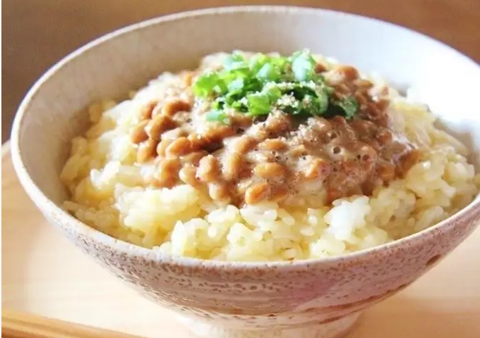

# Raw Egg Natto and Rice

 

[Original Link](https://cookpad.com/us/step_attachment/images/6095898816806912)

## Ingredients

- 1 rice bowl full Hot cooked white rice
- 1 Egg
- 1 tsp Soy sauce
- 1 pack Natto (fermented soy beans)
- 1 Chopped green onion
- 1 Ground sesame seeds
- 1 tsp Sesame oil

## Directions

1. Crack an egg, whisk with soy sauce, and mix well with rice. Open a pack of natto and briskly mix in the container with the accompanying sauce.
1. Transfer the rice to a bowl, top with natto, scatter sliced scallions and ground sesame, pour sesame oil in circular motion, and it's done.
1. If you arrange this on a plate like a cafe dish, a plain egg on rice dish will look fancy.
