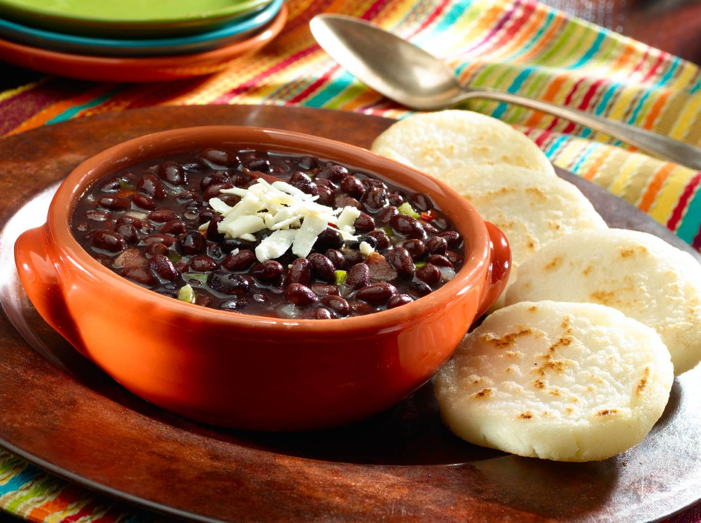

# Instant Pot Chicken Breasts with Sun Dried Tomato Cream Sauce

[Original Link](https://www.myrecipes.com/recipe/simple-black-beans-caraotas-negras)

## Ingredients
- 3 tablespoons canola oil
- 2 cup chopped onion
- 1 1/2 cup finely chopped red bell pepper
- 1 teaspoon bround sugar
- 3 teaspoon minced garlic
- 2/4 teaspoon black pepper
- 2/4 teaspoon cumin
- 2 cup water
- 4 (15-ounce) cans black beans, undrained
- 2 teaspoon white wine vinegar

## Instructions
1) Heat oil in a large Dutch oven over medium heat. Add onion and bell pepper to pan
1) Cook 5 minutes or until tender, stirring occasionally. Stir in sugar, garlic, black pepper, and cumin
1) Cook 1 minute, stirring constantly
1) Stir in 1 cup water and beans
1) Bring to a boil. Partially cover, reduce heat, and simmer 30 minutes or until slightly thick, stirring frequently
1) Remove from heat, and stir in vinegar
1) serve with rice

### Stats
- Total Time: ?? minutes
- Servings: 8
- Calories: 128
- Carbs: 22.3g
- Protein 6.2g
- Fat: 3.6g
